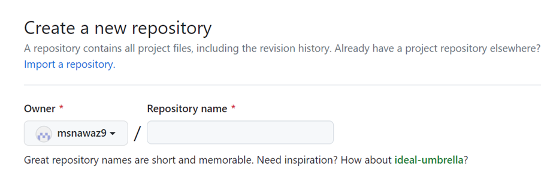
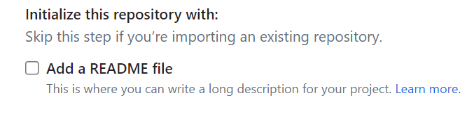
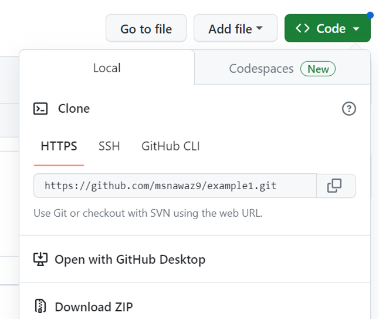
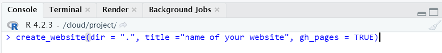
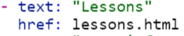
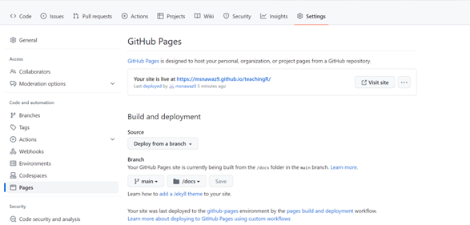
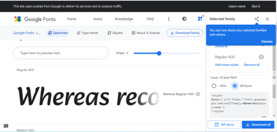
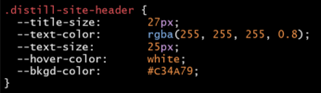

```{r setup, include=FALSE}
knitr::opts_chunk$set(echo = FALSE)
```

## Lesson 1

### Learning Objectives

1.	Opening an account at Github 
2.	Opening a new repository and naming it
3.	Getting code from Github and creating a new R project
4.	Installing package (“distill”)
5.	Creating website 

### Step 1: Sign in on Positcloud

### Step 2: Open Github account

- Open an account with [Github](https://github.com/).
- Go to your repositories and ceate a new repository


### Step 3: Name your repository

- Be CAREFUL as this name will be part of your website




- Add a README file

 


### Step 4: Clone repo

- Click on the green code button and copy URL

-	


### Step 5: New project

- Go to R positcloud and open new project (from Git Repository)


- Add the code that you copied at Github


### Step 6: Setup R 

- Open Project and change appearance.

**Tools-> global options > Appearance**

- (Optional)If you want to see your changes in R instead of new window

**Tools-> global options > R Markdown > show output preview in "Viewer Pane"**

### Step 7: Install distill

- Close and open project again

-	Install “distill” using this code (type in console)   

```{r eval=FALSE,echo=TRUE}

install.packages("distill")

```

- click ENTER


 
- Then type this code

```{r eval=FALSE,echo=TRUE}

library(distill)

```


- click ENTER
 
 
- Go to packages and check if there is a ‘tick’ next to the distill box


### Step 7: Create website

- Copy and paste this code in consule, write the name of your website

```{r eval=FALSE,echo=TRUE}

create_website(dir = ".", title ="name of your website", gh_pages = TRUE)

```



- First change the title of your website and then click “ENTER” to run code

### Your website is now ready to view. 

- We will learn about layouts in the next lesson.


## Lesson 2 

### Learning objectives: 
1)	Find a good layout for your website
2)	Change the title at yml
3)	Add video link and images to pages
4)	Change layout of text
5)	Add emoji to website

### Step 1: Choose layout
Choose a layout/template from this website 
[Seankross postcards](https://github.com/seankross/postcards)

Add this code to console:  

```{r eval=FALSE,echo=TRUE}

install.packages("postcards")
```


### Step 2: Delete old index file

- Tick index.rmd in Files tab (bottom right window)

- Delete index.rmd file

### Step 3:Create layout 

Add this code to console with your chosen template name for example:

```{r eval=FALSE,echo=TRUE}

create_article(file ="index", template= "trestles", package = "postcards")

```

- Click on index.rmd from the Files tab (bottom right window)

- Now go to top left window

-	Copy this code and paste after output in a new line:

```{r eval=FALSE,echo=TRUE}

site: distill::distill_website


```

{width=50%}

•	This creates the template for the homepage

•	Change title

•	KNIT to see a preview of the homepage

### Step 4: Add images to R

- On your computer desktop make a new folder called "Images".

- Add all the images you want to use.

- Change the folder into a compressed folder. 

- Now in your R Positcloud go to bottom right window and click Upload

- Choose the Images Compressed folder. Now you can use all your pictures in R

### Change main picture on your Homepage

- Go to index.rmd

- In the top right window you can see "image:"

- Change image by writing down the name of folder >slash > name of image > dot > format of image. ( in between the speech marks)


- To add picture on any page use this format: 

```{r eval=FALSE,echo=TRUE}


```
 

### Add video (from YouTube) to R

  - Open a Youtube video
  
  - Click “share” and then “embed” then copy code
  
  - Add code to your page

### Step 5: Insert all your information into pages 

- Change layout of page using these symbols

- For title (bigger font) use   # biggest  ,## smaller, ### smaller

- For bold use ** before and after **

- For italics use * before and after *

### Step 6: To insert emoji 

- Run this code in console (bottom left window)

```{r eval=FALSE,echo=TRUE}

install.packages("devtools")

```

- Click ENTER

- then this code: 

```{r eval=FALSE,echo=TRUE}

devtools::install_github("hadley/emo")

```

- Now you can add emoji like this:

```{r eval=FALSE,echo=TRUE}

`r emo::ji("smile")` 

```

- For more emoji names visit [this page](https://github.com/hadley/emo)


## Lesson 3 

### Learning objectives: 
1)	Add new pages to your website
2)	Add icons to buttons
3)	Push changes to Github

### Step 1: Adding more pages to your website

- Go to site.yml

- Now copy ( text and href) of ‘about’

- Paste underneath and rename it

 

- Use this code to make new page 

```{r eval=FALSE,echo=TRUE}

create_article("name")
```

- The name you use needs to be exactly the same as "href" name
 
- Write the title  of thus page in the top left window
 
 **KNIT**
 
### Step 2: Add icons to buttons
 
- Go to index.rmd file

- In the top left window now change the code from "label" like this

```{r eval=FALSE,echo=TRUE}

  - label: '<i class="fab fa-twitter"></i> Twitter'
    url: 'https://twitter.com/R_Girls_School target="_blank"'
  - label: '<i class="fab fa-github"></i> GitHub'
    url: 'https://github.com/R-Girls target="_blank"'
  - label: '<i class="fas fa-envelope"></i> Contact Us'
    url: "mailto:maryam.nawaz@greenoak.bham.sch.uk"

```
 
- Now **Knit** and see changes

- **Taget=_blank** makes sure that the link opens in a new tab (window)

- For more icons-> Go to [website](https://fontawesome.com/search) search and copy code between the <> marks

- keep clicking **Knit** to see changes

### Step 3:  To push to Github

- Enter the following code in console

```{r eval=FALSE,echo=TRUE}

install.packages("usethis")

```

- click ENTER

- Now enter this code into console using your login details with Github

```{r eval=FALSE,echo=TRUE}

usethis::use_git_config(user.name= "your user name",user.email= "your email")

```

- Enter in console 

```{r eval=FALSE,echo=TRUE}
usethis::create_github_token()

```

and get token from Github (90 days)

```{r eval=FALSE,echo=TRUE}

gitcreds::gitcreds_set()
```

- **Enter password or token:** insert password here

- Now go to Git ( top right window) -> click on **commit**

- Tick all the boxes 

- Add a message and click **commit** ->  and then Click **push**

- Your website should have updated on Github


- On Github:
Go to settings -> Pages -> change branch main to /docs
Then view your website as its online now

 


## Lesson 4 
### Learning objectives: 
1)	Create a css file for theme
2)	Import google fonts
3)	Import colours for layout

### Stage 1:Create new theme -> css file

- 	Add this code to console   

```{r eval=FALSE,echo=TRUE}

create_theme(“my-theme”)

```

- 	On _Site.yml add line of code after output_dir: 

```{r eval=FALSE,echo=TRUE}

theme: my_theme.css

```


### Step 2: Change our font

- Import google fonts from this [website](https://fonts.google.com/)
- Search for fav font and select @import 
- copy the code in between the style tags < style>
- Now add at the top of css file all the fonts you want to use. Customise !!!!
- Add more fonts that you want to use for your website


 

	Font sizes (example)
	
	Title size = 40px
	
	Body size = 18px
	
	Code size = 16px
	
	
	
- Always knit to see pages until you are happy with font type and size


 
### Step 3: Choose color palette     

- Go to [coolers website](https://coolors.co/)

- Make a palette and download for later use.
- You can lock colors or press space bar for new colors   
- You can export to pdf (HEX and RGB)
- To change the banner at the top of website go to coding section (my_theme.css file) as shown in pic and here you can change :
	
Example
- Title size = 28px    (how big do you want the banner to be)

- Text color = what colour do you want the text to be

- Text size = 28px   (size of text)

- Hover color = white (when you move mouse over the writing what colour should it change into)

- Background color = #C34A79  (The colour of the banner)

  
### Step 6: After making all the changes you want save on github

Commit- push to save on website


## Lesson 5
### Learning objectives: 
1)	Changing the font colours
2)	Change button colours
3)	Include a navigation bar
4)	Add table of contents

### Step 1: Copy this code at the bottom of css file

```{r eval=FALSE,echo=TRUE}


h1 {
	  color: #C34A79;
	  font-size: 36px;
	}
```


Now you can change the colour and font size of your biggest header on website

### Step2: And now copy this code underneath to change button colours

```{r eval=FALSE,echo=TRUE}
  .btn-outline-dark {
	    background-color: transparent; 
	    color: rgba(195, 74, 121);
	    border: 1px solid;
	    border-color: rgba(195, 74, 121);
	}
	

	.btn-outline-dark:hover {
	    background-color: rgba(195, 74, 121);
	    border-color: rgba(195, 74, 121);
	    color: white;
	}

```


Now you change colours of button using coolers.co website. Also look at [R Grils github](https://github.com/R-Girls/website/blob/main/rgirls-theme.css) for further codes.


### Step 3: Menu bar (dropdown)

- 	Go to _Site.yml
- The menu argument allows you to add dropdown options so the main button will say lesson plans and then you can have the choice to pick which type of lesson plan

- 	Make sure the spaces are properly formatted or you’ll get an error (even one tab off on menu as example)
- Note: the links won’t work yet because we haven’t created the pages yet


