```{r setup, include=FALSE}
knitr::opts_chunk$set(echo = FALSE)
```

## Lesson 1

### Learning Objectives

1.	Opening an account at GitHub 
2.	Opening a new repository and naming it
3.	Getting code from Github and creating a new R project
4.	Installing package (“distill”)
5.	Creating website 

### Step 1: Sign in on Posit Cloud using school email

### Step 2: Open GitHub account

- Open an account with [GitHub](https://github.com/).
- Go to your repositories and ceate a new repository

<center>

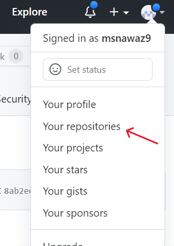{width=30%}

</center>

### Step 3: Name your repository

- Be CAREFUL as this name will be part of your website


<center>

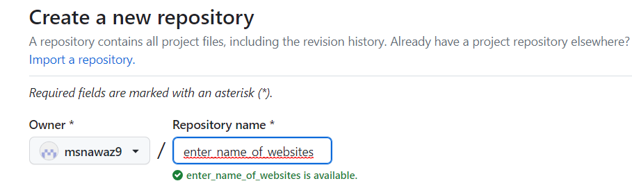{width=70%}
</center>

- Tick the box to 'Add a README file'

<center>
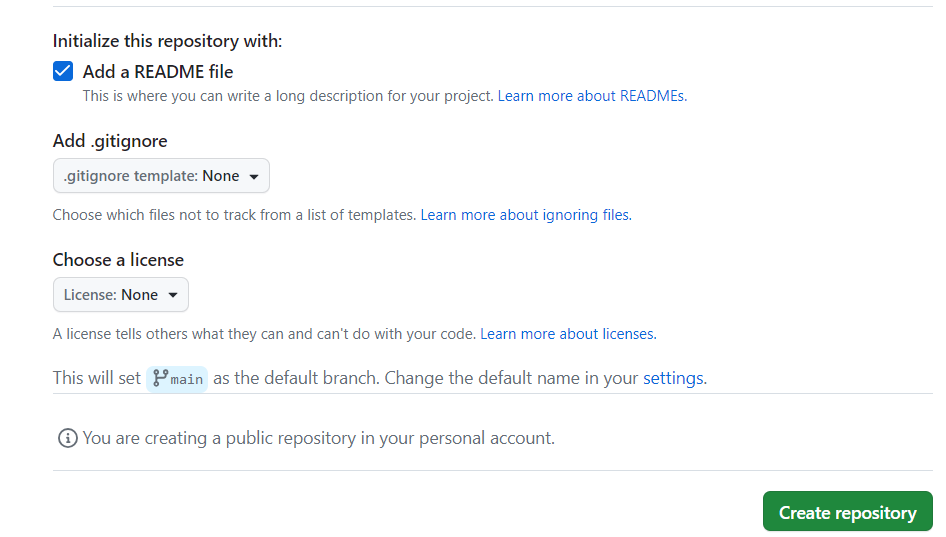{width=70%}
</center>

- Click 'Create repository'.

### Step 4: Clone repo and open new project on R

- Click on the green code button and copy URL

<center>
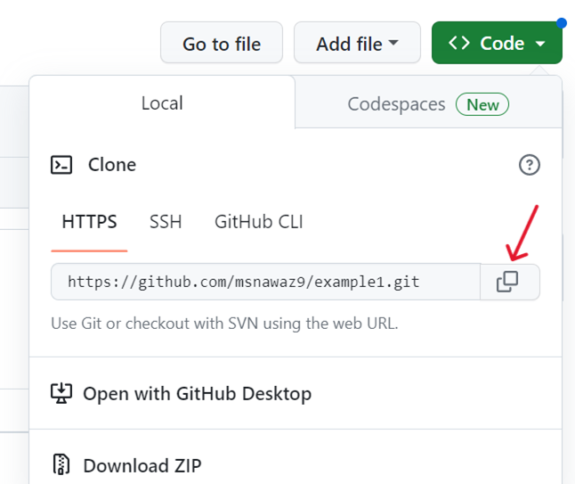{width=50%}
</center>

- Go to R positcloud and open new project (from Git Repository)

<center>

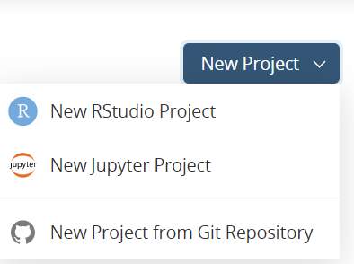{width=50%}
</center>

- Paste in the code that you copied at GitHub


### Step 5: Setup R 

- Open Project and change appearance.

**Tools-> global options > Appearance**

- Scroll down to the Editor theme and choose the theme you like best.

- Click 'Apply' and 'Ok'.

- (Optional) If you want to see your changes in R instead of a new window

**Tools-> global options > R Markdown > show output preview in "Viewer Pane"**

### Step 6: Install distill package

-	Install “distill” using this code (type in console)  

```{r eval=FALSE,echo=TRUE}

install.packages("distill")

```

- Click ENTER


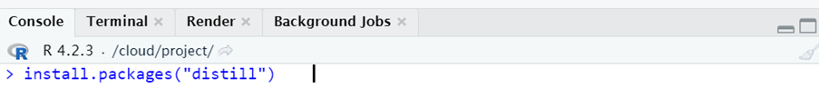
 
- Then type this code

```{r eval=FALSE,echo=TRUE}

library(distill)

```


- click ENTER
 
 
- Go to packages (bottom right pane) and check if there is a ‘tick’ next to the distill box

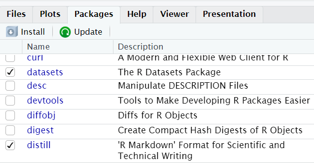{width=75%}

- Close and open project again and then the Build button will appear in the top right pane.

### Step 7: Create website

- Copy and paste this code in console making sure you write the name of your website

```{r eval=FALSE,echo=TRUE}

create_website(dir = ".", title ="name of your website", gh_pages = TRUE)

```
Example: 

<center>
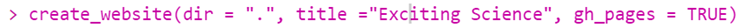
</center>

- Click 'ENTER' to run code

- click **Build** (in top right window) and then **Build Website**

- Note: If you don't see Build tab, close out of your workspace and reopen and the Build tab should appear.

- There may be another message "Do you want to install these packages now?", click 'yes' and it should build your website.

**Your website is now ready to view.**

 We will learn about layouts in the next lesson.
 
<center>
{width=70%}
</center>


## Lesson 2 

### Learning objectives
1)	Find a good layout for your website homepage
2)	Change the title in YAML
3)	Add text on the homepage


### Step 1: Choose layout
Choose a layout/template from this website 
[Seankross postcards](https://github.com/seankross/postcards)

- Click on the link and scroll down to see examples of different homepage templates.

- For example the first template is called "Jolla", the next is called "Jolla Blue", and after that there is "Trestles".

- Continue scolling to see all the available templates to choose from.

- You need to remember the name of the template you want to use.

- Go back to positcloud add this code and click ENTER
 

```{r eval=FALSE,echo=TRUE}

install.packages("postcards")
```


### Step 2: Delete the old index file

- Tick index.rmd in Files tab (bottom right pane)

- Delete index.rmd file

-- The reason you did this is because the index.rmd file is the code for our homepage. You should delete the old index.rmd file because in the next step you will create a new index.rmd file that uses the template of your choosing.


### Step 3: Create template for homepage

Add this code to console with your chosen template name for example:

```{r eval=FALSE,echo=TRUE}

create_article(file ="index", template= "trestles", package = "postcards")

```

- In this example we are using the trestles template but you should include the name of the template you like best.The choices are: "jolla", "trestles", "onofre", "solana". 

- Note: It is important to make sure the templates are spelt correctly or you will get an error message. 

- Your index.rmd should automatically open up in Source Editor.

- In Source Editor (top left pane) type this code after output (roughly around line 15) in a new line:

```{r eval=FALSE,echo=TRUE}

site: distill::distill_website


```

<center>
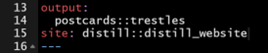{width=50%}
</center>

•	This creates the template for the homepage

•	Change title to the name of your website.

- **Knit** to see a preview of the homepage.

- We will change the image in a later lesson.

### Step 4: Writing text on the homepage

- Now add all your info on your homepage under the YAML chunk (around line 18)

- Change layout of page using these symbols

- Use # for headings; # main heading, ## subheading, ### smaller subheading and so on.

- For bold use ** before and after the word **

- For italics use * before and after the word *

- Save all your changes by clicking on **Knit** and then **Build**

<center>
{width=70%}
</center>


## Lesson 3 

### Learning objectives: 

1)	Personalise homepage
2)  Add images to homepage
3)	Add emoji's

### Step 1: Add images to homepage

- On your computer desktop make a new folder called "Images".

- Save all the images you want to use in the folder.Rename the images to simple names without any spaces. For example instead of "my favorite breed of cat.png", put "cat1.png".

- If possible, right click the folder and choose 'compress to ZIP file'.

<center>
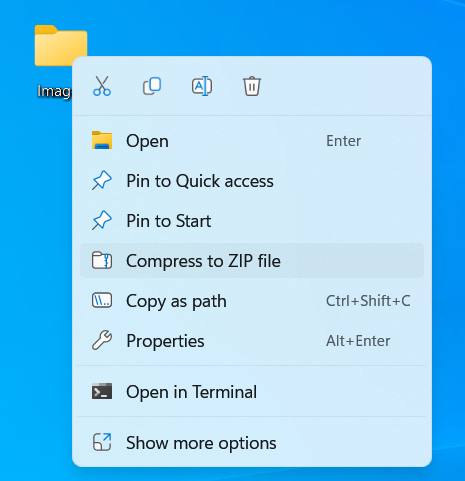{width=50%}
</center>

- Now in your R Positcloud go to bottom right pane and click 'Upload' and select compressed images folder

- If you cannot compress the images folder to zip file then go to the Files tab in the bottom right pane and click 'New folder' and name it 'Images'. Click on the folder to open it and upload your images one by one into the folder. 

- Be careful: Do not change the "Target Directory". Click on "Choose file".

<center>
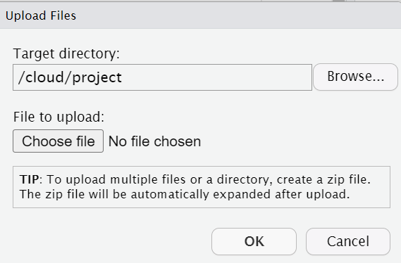{width=50%}
</center>

- Now you can use all your pictures in your website

### Step 2: Change main picture on your homepage

- Under the Files tab in the bottom right pane select 'index.rmd'

- In the Source Editor (top left pane) you can see "image:", (around line 2)

- To change the default image to one of your own images, in between the speech marks you need to enter the image pathway along with the correct file extension.

- To enter the correct pathway, you need to first write the folder name containing the image followed by the actual name of the image and end with the correct file extension.

- In the below example we have entered "images/flower2.jpg", so "images" is the folder, "flower2" is the name of the actual image, and "jpg" is the extension.

- Note: Be careful. The pathway is case sensitive.

<center>
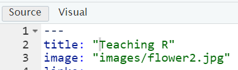{width=60%}
</center>
- To add picture on any page use this format: 

```{r eval=FALSE,echo=TRUE}


```

- After you have added an image KNIT to see if it looks good.

- To adjust the size of the image add {width=30%} or whatever percentage you want after the image pathway.

Example: 

```{r eval=FALSE,echo=TRUE}

{width=30%}

```

### Step 3: Insert emoji 

- Run this code in console (bottom left pane)

```{r eval=FALSE,echo=TRUE}

install.packages("devtools")

```

- Click ENTER

- then this code: 

```{r eval=FALSE,echo=TRUE}

devtools::install_github("hadley/emo")

```

- Click ENTER

- Now you can add emoji like this:

```{r eval=FALSE,echo=TRUE}

`r emo::ji("smile")` 

```

- For more emoji names visit [this page](https://github.com/hadley/emo)


- click **Build** (in top right window) and **then Build Website**

<center>
{width=70%}
</center>

## Lesson 4 

### Learning objectives: 
1)	Add new pages to your website
2)	Add icons to buttons and personalse

### Step 1: Adding more pages to your website

- Under the Files tab click the 'site.yml' file. You will find it in the bottom right pane.

- Now copy the 2 lines starting with 'text' and 'href'.

- Paste underneath and replace whatever is after text with the name of one of your website pages.

- Change the href name to match the page name.

- Repeat these steps for every page in your website.

EXAMPLE:

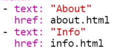{width=40%}

- In the console (bottom left pane) type this code to create a new page.

```{r eval=FALSE,echo=TRUE}

create_article("name")
```

- The name you use needs to be exactly the same as "href" name that you used in 'site.yml' file.

- **Knit** this new page and it will appear in the Source Editor pane.

- Change the title to the name of your page.

- Scroll down and type in whatever text you want to see on your page.

- Make your code look **exactly** like this by deleting unwanted lines.

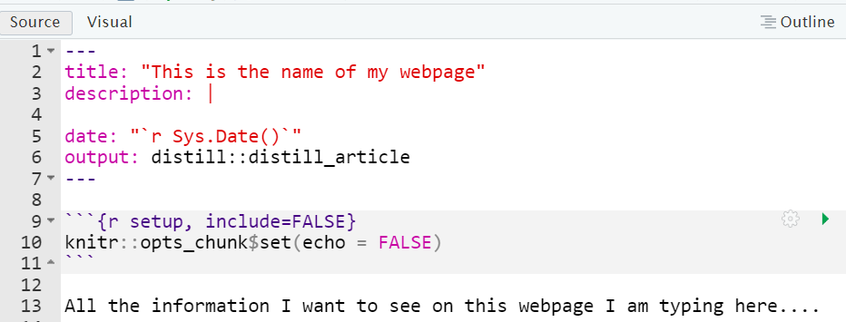{width=90%}
 
 **KNIT**
 
### Step 2: Add icons to buttons
 
- Choose 'index.rmd' file

- In the Source Editor change the 'label' and 'url' lines to look like this.

- Note: Be very careful with spaces, speech marks, brackets etc.

```{r eval=FALSE,echo=TRUE}

  - label: '<i class="fab fa-twitter"></i> Twitter'
    url: 'https://twitter.com/R_Girls_School target="_blank"'
  - label: '<i class="fab fa-github"></i> GitHub'
    url: 'https://github.com/R-Girls target="_blank"'
  - label: '<i class="fas fa-envelope"></i> Contact Us'
    url: "mailto:maryam.nawaz@greenoak.bham.sch.uk"

```
 
- **Knit** and see changes

- "Target=_blank" makes sure that the link opens in a new tab (window)

- (Optional) Use your own personal Twitter and GitHub url's

- Insert your school email address.

- For more icons-> Go to [website](https://fontawesome.com/search), search and copy code between the <> marks

- Keep clicking **Knit** to see changes

- Click **Build** (in top right window) and **then Build Website**

### Step 3:  To push to Github (going ONLINE)

- Enter the following code in console

```{r eval=FALSE,echo=TRUE}

install.packages("usethis")

```

- click ENTER

- Now enter this code into console using your login details with Github

```{r eval=FALSE,echo=TRUE}

usethis::use_git_config(user.name= "your user name",user.email= "your email")

```

- Enter in console 

```{r eval=FALSE,echo=TRUE}
usethis::create_github_token()

```

and get token from Github (90 days)

- Now paste this code into console

```{r eval=FALSE,echo=TRUE}

gitcreds::gitcreds_set()
```

- **Enter password or token:** insert password here

- Save this code somewhere as you might need it again later.

- Now go to Git ( top right window) -> click on **commit**

- Tick all the boxes 

- Add a message and click **commit** ->  and then Click **push**

- Your website should have updated on Github. Go to check on Github.com

**On Github website:**

Go to settings -> Pages -> change branch main to /docs

<center>
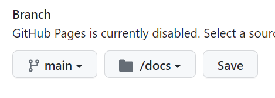{width=50%}
</center>

**Then view your website as its ONLINE now.**

<center>
{width=70%}
</center>

## Lesson 5

### Learning objectives: 
1)	Create a css file for theme
2)	Import google fonts
3)	Import colours for layout

### Stage 1: Create new theme -> css file

- Add this code to console   

```{r eval=FALSE,echo=TRUE}

create_theme("my-theme")

```

- On _site.yml add line of code after output_dir: 

```{r eval=FALSE,echo=TRUE}

theme: my_theme.css

```

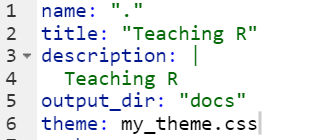{width=40%}

### Step 2: Change your font

- Import google fonts from this [website](https://fonts.google.com/)

- Search for fav font and select @import 

- Copy the code in between the style tags < style>

- Now add at the **top** of css file all the fonts you want to use.

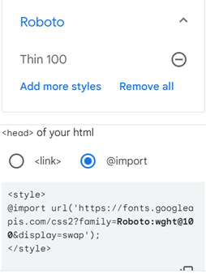{width=50%}


- Always **knit** to see changes until you are happy with font type and size

### Step 3: Choose color palette     

- Go to [coolers website](https://coolors.co/)

- Make a palette and download for later use.

- You can lock colors you like or press space bar for new colors.

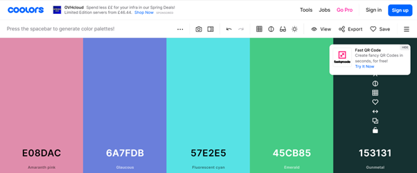 

- To make changes choose your 'my_theme.css' file. See example below :

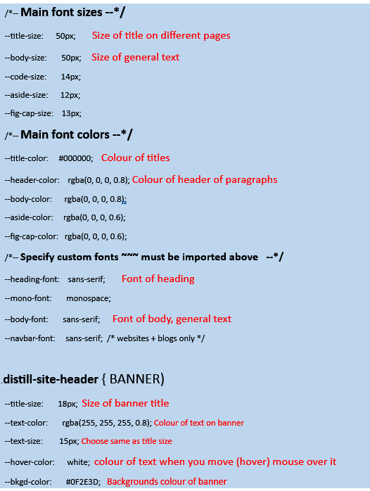{width=70%}

  
### Step 4: Saving Changes

After making all the changes you want save on github

- click **Build** (in top right window) and **then Build Website**

- Commit- push to save on website as mentioned above

<center>
{width=70%}
</center>

## Lesson 6
### Learning objectives: 
1)	Changing the font colours
2)	Change button colours
3)	Include a navigation bar
4)	Add table of contents

### Step 1: Change colour of biggest font

Copy this code at the bottom of css file

```{r eval=FALSE,echo=TRUE}


h1 {
	  color: #C34A79;
	  font-size: 36px;
	}
```

Now you can change the colour and font size of your biggest font on website

### Step2: To change button colours

Copy this code at the bottom of your css file.

```{r eval=FALSE,echo=TRUE}
  .btn-outline-dark {
	    background-color: transparent; 
	    color: rgba(195, 74, 121);
	    border: 1px solid;
	    border-color: rgba(195, 74, 121);
	}
	

	.btn-outline-dark:hover {
	    background-color: rgba(195, 74, 121);
	    border-color: rgba(195, 74, 121);
	    color: white;
	}

```


- Now you change colours of button using coolers.co website.

- Also look at [R Grilsgithub](https://github.com/R-Girls/website/blob/main/rgirls-theme.css) for further codes.


### Step 3: Menu bar (dropdown)

- Go to _site.yml

- The menu argument allows you to add dropdown options in the header.

- 	Make sure the spaces are properly formatted or you’ll get an error (even one tab off on menu as example)

- Note: the links won’t work yet because we haven’t created the pages yet


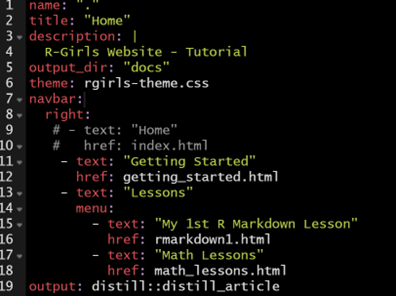{width=75%}

### Step 4: Add table of contents

- Add this code at the top of your page


```{r eval=FALSE,echo=TRUE}
    toc: true
    toc_depth: 3
    toc_float: true

```


- toc means table of content

- toc_depth is the the differet levels of headers you used

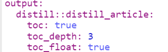{width=50%}

- click **Build** (in top right window) and **then Build Website**

- Push all changes to Github

**Hope you enjoyed making your new website with R `r emo::ji("smile")`**

 